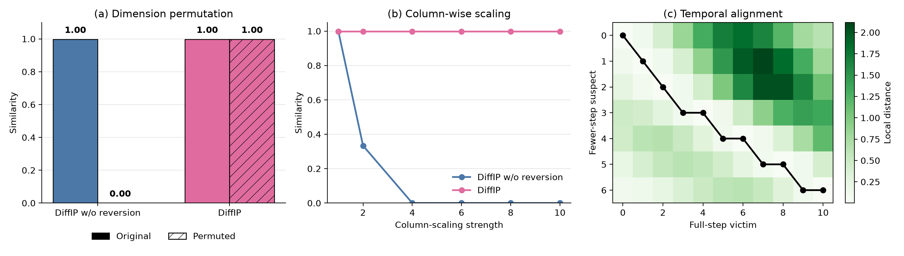

<div align="center">

<h1>DiffIP: Representation Fingerprints for Robust IP Protection of Diffusion Models</h1>

<p><strong>Zhuoling Li¹, Haoxuan Qu¹, Jason Kuen², Jiuxiang Gu², Qiuhong Ke³, Jun Liu¹, Hossein Rahmani¹</strong></p>

<p>¹ Lancaster University &nbsp;·&nbsp; ² Adobe Research &nbsp;·&nbsp; ³ Monash University</p>

<p>
  <a href="https://openaccess.thecvf.com/content/ICCV2025/papers/Li_DiffIP_Representation_Fingerprints_for_Robust_IP_Protection_of_Diffusion_Models_ICCV_2025_paper.pdf"></a>
  <a href="https://zhuoling.site/DiffIP/"></a>
  <a href="LICENSE.md"></a>
</p>

</div>

## 📝 Abstract

Protecting the intellectual property of diffusion models requires robustly
determining whether a suspect model originates from a victim model, including
after fine-tuning or representation camouflage. We introduce **DiffIP**, a
representation-based intrinsic fingerprinting framework designed around the
stochastic and temporal structure of diffusion models. DiffIP reverts shifted
suspect representations towards the victim state and uses
dynamic-programming-based temporal alignment to compare their denoising
trajectories. This enables
fingerprint comparison without injecting an external watermark into the
protected model.

## ⚙️ Method Overview

For a fixed prompt, different random seeds produce a distribution of
representation trajectories. DiffIP treats the representations collected across
seeds at each denoising step as samples and compares the resulting temporal
sequences in two stages:

1. **Representation reversion.** For every pair of time steps, DiffIP estimates
   an orthogonal transformation, per-dimension scaling, and translation that
   revert the suspect representation towards the victim representation.
2. **Temporal fingerprint alignment.** Dynamic programming finds the
   minimum-cost monotone alignment between sequences with potentially different
   denoising schedules.


## 🛠️ Installation

```bash
git clone https://github.com/zhuolingli/DiffIP.git
cd DiffIP
python -m pip install -r requirements.txt
```

## 🚀 Quick Start

Representation fingerprints are first collected from the suspect and victim
diffusion models. Both models are evaluated using the same input prompt and the
same set of random seeds. At each selected denoising step, the target
representations are extracted and flattened. The collected features are then
stacked into two arrays:

- `suspect_representations`: `[T_s, N, D_s]`
- `victim_representations`: `[T_v, N, D_v]`

Here, `T_s` and `T_v` are the numbers of denoising steps, `N` is the shared
number of random seeds, and `D_s` and `D_v` are the respective feature
dimensions. The two models may use different denoising schedules and feature
dimensions, while the seed order must remain consistent.

```python
import numpy as np

from diffip import DiffIPMetric

suspect = np.load("path/to/suspect_representations.npy")  # [T_s, N, D_s]
victim = np.load("path/to/victim_representations.npy")  # [T_v, N, D_v]

result = DiffIPMetric(n_components=20).compare(suspect, victim)
print("similarity:", result.similarity)
print("distance:", result.distance)
```

## 🔍 Key Properties

Beyond effectively identifying models derived from a protected victim model,
DiffIP exhibits three key properties: robustness to dimension permutation,
robustness to column-wise scaling, and temporal alignment. The first two
properties prevent representation camouflage operations from obscuring model
lineage, while temporal alignment enables reliable comparison between models
with unequal-length denoising trajectories, such as a fewer-step distilled
suspect model and its full-step victim model.

<p align="center">
  
</p>

<p align="center"><em>
DiffIP is robust to dimension permutation and column-wise scaling and supports
comparisons between models with unequal-length denoising trajectories.
</em></p>

The property analysis can be conducted with:

```bash
python -m examples.key_properties
```

## 📖 Citation

If you find this work useful, please cite:

```bibtex
@inproceedings{li2025diffip,
  title     = {DiffIP: Representation Fingerprints for Robust IP Protection of Diffusion Models},
  author    = {Li, Zhuoling and Qu, Haoxuan and Kuen, Jason and Gu, Jiuxiang and Ke, Qiuhong and Liu, Jun and Rahmani, Hossein},
  booktitle = {Proceedings of the IEEE/CVF International Conference on Computer Vision},
  year      = {2025},
  doi       = {10.1109/ICCV51701.2025.01582}
}
```

The code is released under the [MIT License](LICENSE.md). Parts of this
implementation were developed with reference to
[netrep](https://github.com/ahwillia/netrep).
